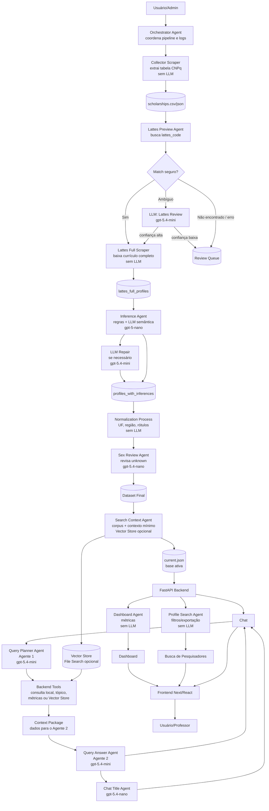

# Fluxo simples com todos os agentes

Este fluxo é uma versão simples para apresentação, mas sem omitir nenhum agente/processo principal.

## Fluxo principal

```txt
Usuário/Admin
  -> Orchestrator Agent
  -> Collector Scraper
  -> Lattes Preview Agent
  -> Lattes Review LLM
  -> Lattes Full Scraper
  -> Inference Agent
  -> Normalization Process
  -> Sex Review Agent
  -> Search Context Agent
  -> Base Ativa
  -> FastAPI Backend
  -> Dashboard Agent
  -> Profile Search Agent
  -> Query Planner Agent
  -> Backend Tools
  -> Query Answer Agent
  -> Chat Title Agent
  -> Frontend
  -> Usuário/Professor
```

## Fluxograma Mermaid



## Lista completa de agentes/processos no fluxo

| Ordem | Nome | Tipo | Modelo |
|---:|---|---|---|
| 1 | `orchestrator_agent` | Agente coordenador | Sem LLM direta |
| 2 | `collector_scraper` | Scraper determinístico | Sem LLM |
| 3 | `lattes_preview_agent` | Scraper + decisão por regras | LLM só se ambíguo |
| 4 | `lattes_review_llm` | Agente LLM de revisão | `gpt-5.4-mini` |
| 5 | `lattes_full_scraper` | Scraper determinístico | Sem LLM |
| 6 | `inference_agent` | Agente de inferência | `gpt-5-nano` |
| 7 | `inference_repair_llm` | Agente LLM de reparo | `gpt-5.4-mini` |
| 8 | `normalization_process` | Processo determinístico | Sem LLM |
| 9 | `sex_review_agent` | Agente LLM de revisão | `gpt-5.4-nano` |
| 10 | `search_context_agent` | Preparação de contexto | Sem LLM direta |
| 11 | `dashboard_agent` | Agente analítico determinístico | Sem LLM |
| 12 | `profile_search_agent` | Agente de busca determinística | Sem LLM |
| 13 | `query_planner_agent` | Agente LLM do chat | `gpt-5.4-mini` |
| 14 | `backend_tools` | Ferramentas controladas | Sem LLM direta |
| 15 | `query_answer_agent` | Agente LLM do chat | `gpt-5.4-mini` |
| 16 | `chat_title_agent` | Agente LLM auxiliar | `gpt-5.4-nano` |

## Narrativa curta

```txt
O Orchestrator Agent coordena a pipeline.
O Collector Scraper coleta a tabela oficial do CNPq.
O Lattes Preview Agent encontra o currículo correspondente.
Se houver ambiguidade, o Lattes Review LLM escolhe entre candidatos.
Com o lattes_code resolvido, o Lattes Full Scraper baixa o currículo completo.
O Inference Agent transforma o currículo em campos úteis para análise.
Depois, normalizamos os dados e revisamos sexo desconhecido.
O Search Context Agent prepara a base para dashboard, busca e chat.
No backend, Dashboard Agent e Profile Search Agent servem as telas.
No chat, o Query Planner Agent escolhe ferramentas, o Backend Tools monta contexto e o Query Answer Agent responde.
```

## Versão ultra curta para falar

```txt
Coletamos CNPq, encontramos o Lattes, resolvemos ambiguidades com LLM,
baixamos o currículo completo, inferimos campos, normalizamos a base
e servimos tudo por dashboard, busca e chat multiagente.
```

