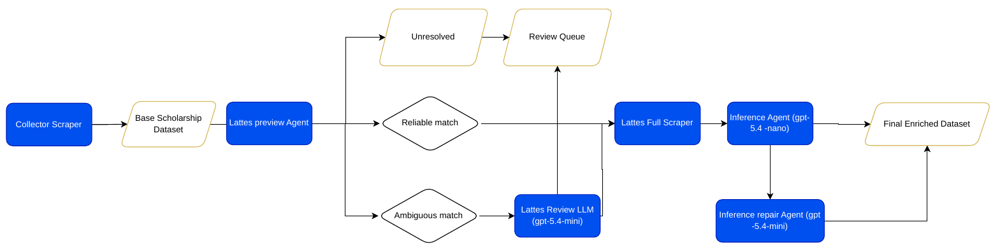
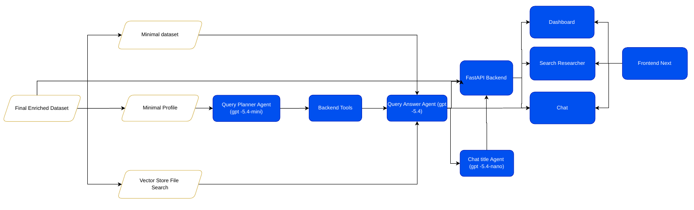

# Agentic API

Sistema para coletar, enriquecer, visualizar e consultar dados de bolsistas PQ de Ciência da Computação a partir de fontes públicas do CNPq e do Currículo Lattes.

O projeto combina uma API FastAPI, uma interface Next/React e um fluxo com agentes de LLM para transformar dados públicos em dashboard, busca de pesquisadores e chat analítico.

## Arquitetura Agentic

### Coleta e enriquecimento dos dados

### Consulta, backend e frontend

Clique nos diagramas para abrir as versões em PDF.

## Relatório Do Projeto

- [Artigo e apresentação do trabalho](Report_AgenticAI_ESA-3.pdf)

## O Que O Sistema Faz

- coleta a lista inicial de bolsistas PQ do CNPq;
- encontra e baixa currículos Lattes;
- enriquece perfis com inferências estruturadas;
- organiza métricas para dashboard;
- permite buscar pesquisadores por nome, instituição, área, bolsa e outros filtros;
- responde perguntas em linguagem natural usando duas etapas de LLM: planejamento e resposta final.

## Principais Telas

- **Dashboard**: distribuições, rankings, concentração institucional e cruzamentos.
- **Pesquisadores**: cartões com foto, instituição, bolsa, área, cargo, Lattes e ORCID.
- **Chat**: perguntas em linguagem natural sobre a base.
- **Configurações**: base ativa, histórico de execuções e controle bloqueado da pipeline.

## Documentação

- [Instalação e funcionamento](docs/INSTALACAO_E_FUNCIONAMENTO.md)
- [Documentação completa antiga](docs/README_COMPLETO.md)
- [Índice da documentação técnica](docs/README.md)
- [ADRs](ADR/)

