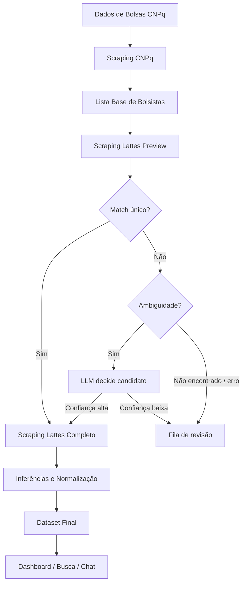

# Fluxograma simples da pipeline

Este é o fluxo mais enxuto para explicar a coleta e o enriquecimento dos dados.

## Versão para Miro

Use estas caixas, nessa ordem:

```txt
1. Dados de Bolsas CNPq
2. Scraping CNPq
3. Lista Base de Bolsistas
4. Scraping Lattes Preview
5. Match único?
6. Ambiguidade?
7. LLM decide candidato
8. Fila de revisão
9. Scraping Lattes Completo
10. Inferências e Normalização
11. Dataset Final
12. Dashboard / Busca / Chat
```

## Conexões

```txt
Dados de Bolsas CNPq
  -> Scraping CNPq
  -> Lista Base de Bolsistas
  -> Scraping Lattes Preview
  -> Match único?
```

```txt
Match único?
  -> Sim
  -> Scraping Lattes Completo
```

```txt
Match único?
  -> Não
  -> Ambiguidade?
```

```txt
Ambiguidade?
  -> Sim
  -> LLM decide candidato
```

```txt
LLM decide candidato
  -> Confiança alta
  -> Scraping Lattes Completo
```

```txt
LLM decide candidato
  -> Confiança baixa
  -> Fila de revisão
```

```txt
Ambiguidade?
  -> Não encontrado / erro
  -> Fila de revisão
```

```txt
Scraping Lattes Completo
  -> Inferências e Normalização
  -> Dataset Final
  -> Dashboard / Busca / Chat
```

## Mermaid



## Agentes no fluxo

Use esta tabela como apoio ao lado do fluxograma. Ela mostra onde existe agente, onde é apenas scraping e onde entra LLM.

| Ordem | Nome no fluxo | Tipo | Responsabilidade | LLM/modelo |
|---:|---|---|---|---|
| 1 | `orchestrator_agent` | Agente coordenador | Roda a pipeline, registra logs e promove a base final | Não usa LLM diretamente |
| 2 | `collector_scraper` | Scraper determinístico | Extrai a tabela oficial do CNPq | Sem LLM |
| 3 | `lattes_preview_agent` | Scraper + agente de decisão | Busca candidatos Lattes e tenta resolver o match | Só chama LLM se houver ambiguidade |
| 4 | `lattes_review_llm` | LLM de revisão | Escolhe entre candidatos Lattes já encontrados | `gpt-5.4-mini` |
| 5 | `lattes_full_scraper` | Scraper determinístico | Baixa o currículo completo pelo `lattes_code` | Sem LLM |
| 6 | `inference_agent` | Agente de inferência | Gera campos derivados e semânticos para análise | `gpt-5-nano`; reparo com `gpt-5.4-mini` |
| 7 | `normalization_process` | Processo determinístico | Normaliza UF, região, bolsa e rótulos | Sem LLM |
| 8 | `sex_review_agent` | Agente de revisão | Revisa apenas sexo inferido desconhecido | `gpt-5.4-nano` |
| 9 | `search_context_agent` | Processo/agente de preparação | Gera corpus de busca, contexto mínimo e Vector Store opcional | Sem LLM direta |
| 10 | `dashboard_agent` | Agente analítico determinístico | Calcula métricas para o dashboard | Sem LLM |
| 11 | `profile_search_agent` | Agente de busca determinística | Lista, filtra e exporta pesquisadores | Sem LLM |
| 12 | `query_planner_agent` | Agente LLM do chat | Decide quais dados/ferramentas o Agente 2 precisa | `gpt-5.4-mini` |
| 13 | `backend_tools` | Ferramentas controladas | Consulta local, busca por tópico, métricas e File Search | Sem LLM direta |
| 14 | `query_answer_agent` | Agente LLM do chat | Valida o contexto e redige a resposta final | `gpt-5.4-mini` |
| 15 | `chat_title_agent` | Agente LLM auxiliar | Gera título curto para a conversa | `gpt-5.4-nano` |

## Narrativa dos agentes

```txt
O orchestrator_agent é quem conduz o processo inteiro.
Ele começa pelo collector_scraper, que só extrai a tabela CNPq.

Depois entra o lattes_preview_agent.
Se o Lattes retorna um candidato único e seguro, o fluxo segue.
Se retorna vários candidatos plausíveis, o lattes_review_llm decide entre eles.
Se a confiança for baixa, o caso vai para revisão.

Com o lattes_code resolvido, o lattes_full_scraper baixa o currículo completo.
Esse currículo alimenta o inference_agent, que cria os campos úteis para dashboard e chat.

Depois o normalization_process organiza os rótulos e o sex_review_agent revisa casos sem sexo inferido.

Com o dataset final pronto, o search_context_agent prepara a base para busca e o Vector Store opcional.
O dashboard_agent calcula métricas.
O profile_search_agent permite pesquisar pesquisadores.

No chat, o query_planner_agent é o Agente 1:
ele não responde; ele decide quais ferramentas/dados são necessários.
O backend executa essas ferramentas e monta um pacote de contexto.
O query_answer_agent é o Agente 2:
ele recebe o pacote, valida e responde ao usuário.
```

## Fluxo do chat em uma frase

```txt
Pergunta -> Query Planner Agent -> Backend Tools / Vector Store -> Context Package -> Query Answer Agent -> Resposta
```

## Texto curto para apresentar

```txt
Primeiro coletamos a tabela oficial do CNPq, que traz os bolsistas e os dados da bolsa.
Depois usamos nome e instituição para buscar o currículo Lattes.
Quando existe um único candidato seguro, seguimos direto para o currículo completo.
Quando há ambiguidade, uma LLM atua como revisora e escolhe apenas entre candidatos já encontrados.
Se a confiança for baixa, o caso vai para fila de revisão.
Com os currículos completos, geramos inferências, normalizamos os campos e montamos o dataset final usado pelo dashboard, busca e chat.
```

## Legenda simples

```txt
Azul: scraping/processo
Roxo: LLM
Amarelo: dado/arquivo
Vermelho claro: revisão
Verde: produto final/API
```
