# Fluxograma e prompt de explicação do sistema

Este arquivo contém um fluxograma do funcionamento completo do projeto e um prompt pronto para usar em slides, documentação ou para pedir a uma LLM que explique a arquitetura do sistema.

## Fluxograma geral

```mermaid
flowchart TD
    A[Usuário/Admin] -->|opcional: POST /admin/pipeline/run| ORCH[orchestrator_agent<br/>app/scrapers/pipeline_scrape.py]

    ORCH --> CNPQ[collector_agent<br/>app/scrapers/simple_scrape.py]
    CNPQ -->|extrai tabela CNPq| CNPQ_OUT[(scholarships.csv/json)]

    CNPQ_OUT --> PREVIEW[lattes_preview_agent<br/>app/scrapers/lattes_scrape.py]
    PREVIEW -->|busca lattes_code| PREVIEW_RULES{Match seguro?}

    PREVIEW_RULES -->|sim| PREVIEW_OK[(lattes_profiles.csv/json)]
    PREVIEW_RULES -->|erro técnico| RETRY[retry técnico até 5 vezes]
    RETRY --> PREVIEW_RULES
    PREVIEW_RULES -->|ambíguo| LATTES_LLM[LLM: revisão Lattes<br/>review_ambiguous_with_llm<br/>modelo: LATTES_LLM_MODEL<br/>padrão: gpt-5.4-mini]
    LATTES_LLM -->|matched se confiança >= 0.85| PREVIEW_OK
    LATTES_LLM -->|incerto| PREVIEW_REVIEW[(review_queue.csv/json<br/>llm_review.json)]

    PREVIEW_OK --> FULL[lattes_full_agent<br/>app/scrapers/lattes_scrape.py]
    FULL -->|currículo completo| FULL_OUT[(lattes_full_profiles.csv/json<br/>raw HTML/TXT/JSON)]
    FULL -->|falha / sem currículo| FULL_REVIEW[(review_queue_full.csv/json)]

    FULL_OUT --> INF[inference_agent<br/>app/scrapers/inference_scrape.py]
    INF --> RULES[Regras locais<br/>UF, região, categoria bolsa,<br/>ano doutorado, sexo inicial]
    RULES --> INF_LLM1[LLM: rule_validation<br/>valida/corrige regras]
    INF_LLM1 --> INF_LLM2[LLM: semantic_generation:research<br/>área, tópicos, métodos, domínios]
    INF_LLM2 --> INF_LLM3[LLM: semantic_generation:career<br/>carreira, cargo, senioridade]
    INF_LLM3 --> INF_LLM4[LLM: semantic_generation:experience_outputs<br/>experiência internacional, gestão,<br/>eventos, software/patentes]
    INF_LLM4 --> INF_LLM5[LLM: semantic_generation:dashboard_qa<br/>resumos, keywords, tags,<br/>contexto para perguntas]

    INF_LLM5 -->|erros JSON/timeout| REPAIR[LLM de reparo<br/>INFERENCES_REPAIR_LLM_MODEL<br/>padrão: gpt-5.4-mini]
    REPAIR --> INF_OUT
    INF_LLM5 --> INF_OUT[(profiles_with_inferences.csv/json<br/>inference_llm.json<br/>summary.json<br/>review_queue)]

    INF_OUT --> NORM[normalization_agent<br/>app/scrapers/normalize_inferences.py]
    NORM --> SEX[sex_review_agent<br/>app/scrapers/review_unknown_sex.py<br/>LLM para revisar sex_inferred unknown<br/>modelo: SEX_REVIEW_MODEL<br/>padrão: gpt-5.4-nano]
    SEX --> CURRENT[(scrape_results/current.json<br/>base ativa)]

    CURRENT --> SEARCH_CTX[search_context_agent<br/>search_corpus_service.py<br/>minimal_profiles_context_service.py]
    SEARCH_CTX --> CORPUS[(profiles_search_corpus.json<br/>minimal_profiles_context.json/txt<br/>metadata)]
    CORPUS --> VECTOR[Vector Store opcional<br/>openai_vector_store_service.py<br/>File Search]

    CURRENT --> DASH_SERVICE[dashboard_agent<br/>dashboard_service.py]
    DASH_SERVICE --> DASH_API[GET /dashboard/metrics]
    CURRENT --> PROFILE_SERVICE[profile_search_agent<br/>profile_service.py]
    PROFILE_SERVICE --> PROFILE_API[GET /profiles<br/>GET /profiles/export.csv]

    USER_FRONT[Usuário no frontend<br/>Next/React] --> FRONT[Frontend<br/>/login /dashboard /profiles /chat]
    FRONT --> AUTH[POST /login<br/>auth hardcoded demo]
    FRONT --> DASH_API
    FRONT --> PROFILE_API

    FRONT --> CHAT_LEGACY[POST /session<br/>POST /session/:id/message]
    CHAT_LEGACY --> STORAGE[(chat_storage_service.py<br/>scrape_results/chat/sessions)]
    CHAT_LEGACY --> PLANNER[query_planner_agent<br/>LLM planner<br/>não responde ao usuário<br/>decide dados/ferramentas para o Agente 2<br/>CHAT_PLANNER_MODEL<br/>padrão: gpt-5.4-mini]

    PLANNER --> TOOLS{Ferramenta escolhida}
    TOOLS -->|structured_query| STRUCT[Consulta local determinística<br/>profiles_with_inferences.json]
    TOOLS -->|topic search| TOPIC[Busca candidatos por tópico<br/>validação semântica posterior]
    TOOLS -->|file_search quando pergunta exigir busca semântica| VECTOR
    TOOLS -->|contexto geral| DASH_SERVICE

    STRUCT --> CTX[Context Package<br/>dados necessários para resposta:<br/>contagens, candidatos, métricas,<br/>histórico e/ou trechos do Vector Store]
    TOPIC --> CTX
    VECTOR --> CTX
    DASH_SERVICE --> CTX
    STORAGE --> CTX
    CTX --> ANSWER[query_answer_agent<br/>LLM resposta/validação<br/>recebe o pacote montado pelo Agente 1/backend<br/>CHAT_MODEL<br/>padrão: gpt-5.4-mini]

    ANSWER --> CHAT_TITLE[chat_title_agent<br/>gera título curto<br/>CHAT_TITLE_MODEL<br/>padrão: gpt-5.4-nano]
    ANSWER --> FRONT
    CHAT_TITLE --> STORAGE
```



## Fluxo resumido por requisito

```txt
RF01 Dataset:
  CNPq -> Lattes preview -> Lattes completo -> inferências -> normalização -> current.json

RF02 Dashboard:
  current.json -> dashboard_service -> GET /dashboard/metrics -> frontend /dashboard

RF03 Exportação:
  current.json -> profile_service -> GET /profiles/export.csv

RF04 Consulta em linguagem natural:
  frontend /chat -> session route -> query_planner_agent -> tools -> query_answer_agent

RF05 Logs:
  logs/pipeline_*.log
  summary.json por etapa
  retry_log.json
  llm_review.json
  inference_llm.json
  normalization_log.json
  sex_unknown_review_log.json
  sessões em scrape_results/chat/sessions
```

## Chamadas LLM do sistema

| Etapa | Agente | Quando chama | Modelo padrão | Arquivo |
|---|---|---|---|---|
| Lattes preview | `lattes_preview_agent` | Apenas em candidatos ambíguos | `gpt-5.4-mini` | `app/scrapers/lattes_scrape.py` |
| Inferência: validação de regras | `inference_agent` | Para validar/corrigir campos de regra | `gpt-5-nano` | `app/scrapers/inference_scrape.py` |
| Inferência: pesquisa | `inference_agent` | Área, tópicos, métodos, domínios | `gpt-5-nano` | `app/scrapers/inference_scrape.py` |
| Inferência: carreira | `inference_agent` | Senioridade, cargo, estágio | `gpt-5-nano` | `app/scrapers/inference_scrape.py` |
| Inferência: experiências | `inference_agent` | Internacional, gestão, eventos, software/patentes | `gpt-5-nano` | `app/scrapers/inference_scrape.py` |
| Inferência: dashboard/QA | `inference_agent` | Resumo, tags, keywords e contexto de perguntas | `gpt-5-nano` | `app/scrapers/inference_scrape.py` |
| Reparo de inferência | `inference_agent` | Apenas quando há erro/JSON inválido/timeout | `gpt-5.4-mini` | `app/scrapers/inference_scrape.py` |
| Revisão de sexo unknown | `sex_review_agent` | Apenas para `sex_inferred=unknown` | `gpt-5.4-nano` | `app/scrapers/review_unknown_sex.py` |
| Planejamento do chat | `query_planner_agent` | Toda pergunta do chat | `gpt-5.4-mini` | `app/services/chat_service.py` |
| Resposta/validação do chat | `query_answer_agent` | Toda pergunta do chat | `gpt-5.4-mini` | `app/services/chat_service.py` |
| Título do chat | `chat_title_agent` | Ao criar conversa | `gpt-5.4-nano` | `app/services/chat_service.py` |

## Prompt para explicar o sistema

Use o prompt abaixo para pedir a uma LLM, ou para guiar uma explicação em apresentação:

```txt
Explique o funcionamento de um sistema multiagente desenvolvido para coletar, enriquecer, visualizar e consultar dados de bolsistas PQ de Ciência da Computação a partir de uma página pública do CNPq.

Contexto do trabalho:
- RF01: gerar dataset com nome, sexo, instituição, UF, nível da bolsa, área de atuação, ano de conclusão do doutorado, URL e Google Scholar quando possível.
- RF02: disponibilizar dashboard.
- RF03: permitir exportação CSV/PDF, sendo CSV priorizado no MVP.
- RF04: disponibilizar consulta em linguagem natural.
- RF05: registrar logs das operações.

Arquitetura geral:
- Backend em FastAPI.
- Frontend em Next/React.
- Dados em CSV/JSON locais para o MVP.
- Base ativa apontada por scrape_results/current.json.
- Scripts em app/scrapers.
- Serviços em app/services.
- Rotas em app/routers.
- Logs e artefatos em scrape_results/ e logs/.

Explique o sistema por agentes:

1. orchestrator_agent
   - Implementado em app/scrapers/pipeline_scrape.py e app/services/pipeline_admin_service.py.
   - Coordena a pipeline completa.
   - Decide se uma run pode promover current.json.
   - Gera logs em logs/pipeline_*.log.
   - Expõe rotas POST /admin/pipeline/run e GET /admin/pipeline/status.

2. collector_agent
   - Implementado em app/scrapers/simple_scrape.py.
   - Extrai a tabela pública do CNPq.
   - Gera a lista base de bolsistas em scholarships.csv/json.
   - Não usa LLM porque a fonte é uma tabela estruturada.

3. lattes_preview_agent
   - Implementado em app/scrapers/lattes_scrape.py.
   - Recebe scholarships.csv.
   - Busca o currículo Lattes correspondente e resolve o lattes_code.
   - Usa regras locais por nome/instituição.
   - Se houver ambiguidade, chama uma LLM revisora.
   - Chamada LLM: review_ambiguous_with_llm.
   - Modelo padrão: gpt-5.4-mini via LATTES_LLM_MODEL.
   - Guardrail: a LLM só escolhe entre candidatos já coletados; confiança baixa fica em review_queue.
   - Saídas principais: lattes_profiles.csv/json e review_queue.

4. lattes_full_agent
   - Implementado em app/scrapers/lattes_scrape.py.
   - Recebe lattes_code resolvido.
   - Baixa e estrutura o currículo completo.
   - Salva lattes_full_profiles.csv/json e artefatos brutos para auditoria.
   - Não usa LLM por padrão.

5. inference_agent
   - Implementado em app/scrapers/inference_scrape.py.
   - Recebe lattes_full_profiles.json.
   - Gera campos determinísticos por regra local:
     institution_state_uf, institution_region, scholarship_category, scholarship_level_rank, doctorate_year, years_since_doctorate, profile_language e sex_inferred inicial.
   - Usa LLM barata para validar regras e gerar campos semânticos:
     main_research_area, secondary_research_areas, research_topics, methods_and_techniques, application_domains, career_stage, academic_rank, seniority_level, experiências, resumos, keywords, dashboard_tags e qa_context.
   - Modelo padrão: gpt-5-nano via INFERENCES_LLM_MODEL.
   - Modo: INFERENCES_LLM_MODE=split.
   - Fases LLM:
     rule_validation;
     semantic_generation:research;
     semantic_generation:career;
     semantic_generation:experience_outputs;
     semantic_generation:dashboard_qa.
   - Em caso de erro, usa modelo de reparo INFERENCES_REPAIR_LLM_MODEL, padrão gpt-5.4-mini.
   - Saídas: profiles_with_inferences.csv/json, inference_llm.json, inference_review_queue.csv/json e summary.json.

6. normalization_agent
   - Implementado em app/scrapers/normalize_inferences.py.
   - Normaliza regiões, instituições e rótulos.
   - Corrige inconsistências como regiões em inglês.
   - Salva normalization_log.json.

7. sex_review_agent
   - Implementado em app/scrapers/review_unknown_sex.py.
   - Revisa apenas casos de sex_inferred unknown.
   - Usa nome completo, lattes_name e texto público disponível.
   - Modelo padrão: gpt-5.4-nano via SEX_REVIEW_MODEL.
   - Guardrail: sexo é inferido para estatística, não confirmação documental.
   - Salva sex_unknown_review_log.json.

8. search_context_agent
   - Implementado em search_corpus_service.py, minimal_profiles_context_service.py e openai_vector_store_service.py.
   - Gera profiles_search_corpus.json para busca semântica.
   - Gera minimal_profiles_context.json/txt com nome, primeiro nome, sexo inferido, instituição, bolsa, UF e região.
   - Pode sincronizar corpus com OpenAI Vector Store.

9. dashboard_agent
   - Implementado em app/services/dashboard_service.py e app/routers/dashboard.py.
   - Lê a base ativa pelo current.json.
   - Calcula métricas agregadas.
   - Expõe GET /dashboard/metrics.
   - Alimenta gráficos no frontend.

10. profile_search_agent
    - Implementado em app/services/profile_service.py e app/routers/profiles.py.
    - Lista pesquisadores, permite filtros e paginação.
    - Expõe GET /profiles, GET /profiles/{id} e GET /profiles/export.csv.

11. query_planner_agent
    - Implementado em app/services/chat_service.py.
    - Primeira chamada LLM do chat.
    - Recebe pergunta, histórico curto, métricas do dashboard e contexto mínimo.
    - Não responde ao usuário final.
    - Decide quais dados o segundo agente precisa.
    - Decide ferramenta: structured_query, topic search, file_search/Vector Store ou resposta contextual.
    - Modelo padrão: gpt-5.4-mini via CHAT_PLANNER_MODEL.
    - Retorna plano JSON.
    - Guardrail: não executa código; só escolhe ferramentas permitidas.

12. backend tools do chat
    - structured_query calcula contagens e filtros no JSON local.
    - topic search retorna candidatos para validação semântica.
    - file_search recupera trechos do Vector Store quando a pergunta precisa de busca semântica no corpus.
    - dashboard_metrics_context fornece visão agregada.
    - O backend monta um Context Package para o Agente 2, contendo apenas os dados necessários para responder:
      contagens, listas filtradas, candidatos, trechos recuperados, métricas e histórico recente.

13. query_answer_agent
    - Implementado em app/services/chat_service.py.
    - Segunda chamada LLM do chat.
    - Recebe o plano e o Context Package montado a partir da decisão do Agente 1.
    - Valida candidatos em temas ambíguos como robótica, eletrônica ou IA na saúde.
    - Redige resposta final.
    - Modelo padrão: gpt-5.4-mini via CHAT_MODEL.

14. chat_title_agent
    - Implementado em app/services/chat_service.py.
    - Gera título curto para a conversa.
    - Modelo padrão: gpt-5.4-nano via CHAT_TITLE_MODEL.

15. auth/demo_agent
    - Implementado em app/routers/auth.py.
    - Rota POST /login com admin@admin.com e senha admin.
    - É apenas autenticação de demonstração.

16. frontend
    - Implementado em frontend/.
    - Páginas principais: /login, /dashboard, /profiles e /chat.
    - Consome /dashboard/metrics para gráficos.
    - Consome /profiles para busca/listagem.
    - Consome /session e /session/:id/message para chat.

Explique os guardrails principais:
- LLM não substitui fonte oficial.
- CNPq é fonte da bolsa.
- Lattes é fonte curricular.
- Scholar é opcional por risco de falso positivo.
- LLM do Lattes só escolhe candidatos já coletados.
- Chat não executa código gerado pela LLM.
- Contagens exatas são feitas por consulta local, não por recuperação semântica.
- Temas ambíguos são validados pela LLM final.
- Runs limitadas ou com erro não promovem current.json.
- Campos inferidos, especialmente sex_inferred, devem ser tratados como apoio analítico.

Explique as decisões arquiteturais:
- CSV/JSON local foi escolhido para MVP por auditabilidade, simplicidade e exportação.
- Pipeline foi dividido em etapas para permitir revisão, retry e rastreabilidade.
- File Search é opcional e usado para semântica, não para contagens globais.
- Dashboard e chat compartilham métricas para evitar divergência.
- APIs convencionais foram usadas em vez de MCP server próprio porque as tools são locais e controladas.
- O frontend é Next/React e o backend FastAPI.

Finalize com um resumo:
O sistema começa em uma página CNPq, passa por agentes de scraping e enriquecimento Lattes, usa LLMs em pontos controlados para desambiguação e inferência, promove uma base ativa auditável e disponibiliza essa base por dashboard, busca de pesquisadores, exportação CSV e chat em linguagem natural.
```
